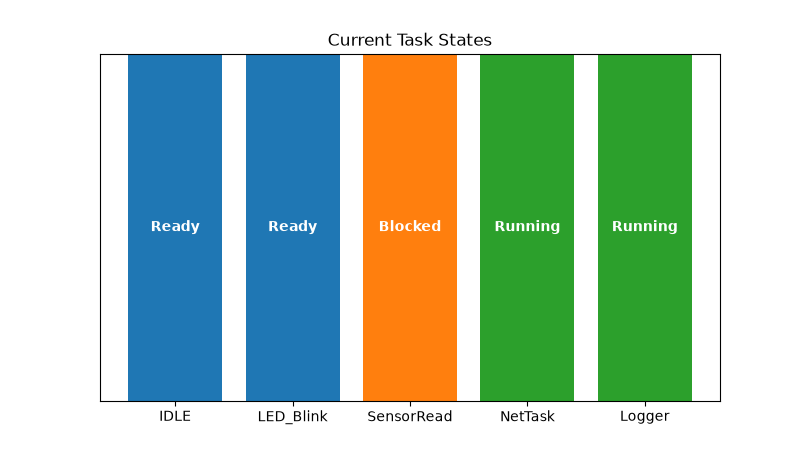
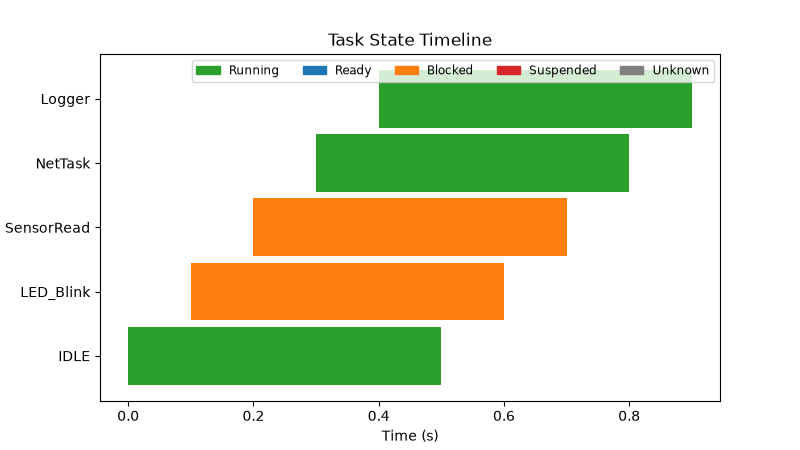
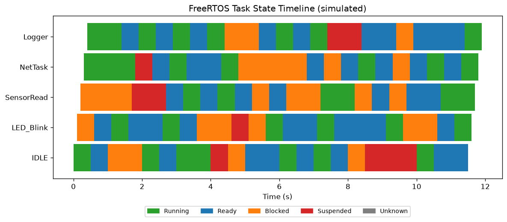

<p align="center">
  <h1 align="center">freeRTOS-visualizer</h1>
</p>

<p align="center">
  <b>Real-time visualization of FreeRTOS task states over serial. Open-source and cross-platform.</b>
</p>

<p align="center">
  <i>Zero on-target instrumentation — no J-Link, no RTT, no recorder library.<br/>
  If your firmware can <code>printf</code> a line over a UART, you can see your tasks.</i>
</p>

<p align="center">
  
  
  
  
  <a href="https://github.com/hariharanragothaman/freeRTOS-visualizer/actions/workflows/ci.yml"></a>
  <a href="https://codecov.io/gh/hariharanragothaman/freeRTOS-visualizer"></a>
  <a href="https://github.com/hariharanragothaman/freeRTOS-visualizer/actions/workflows/codeql.yml"></a>
  <a href="https://scorecard.dev/viewer/?uri=github.com/hariharanragothaman/freeRTOS-visualizer"></a>
  <a href="SECURITY.md"></a>
  <a href="LICENSE"></a>
  <a href="https://github.com/hariharanragothaman/freeRTOS-visualizer/stargazers"></a>
</p>

<p align="center">
  <a href="#why-this-tool">Why This Tool</a> · <a href="#demo">Demo</a> · <a href="#features">Features</a> · <a href="#how-it-works">How It Works</a> · <a href="#quick-start">Quick Start</a> · <a href="#cli-options">CLI Options</a> · <a href="#serial-protocol">Serial Protocol</a> · <a href="#security">Security</a> · <a href="#development">Development</a> · <a href="#project-layout">Project Layout</a> · <a href="#roadmap">Roadmap</a>
</p>

---

## Why this tool?

The first question in any RTOS community is fair: **how is this different from
[SystemView](https://www.segger.com/products/development-tools/systemview/),
which is free and already does microsecond-resolution context-switch tracing?**

It is **less powerful on purpose, in exchange for radically lower friction.**

The gap it fills is **zero on-target instrumentation infrastructure**. No
J-Link, no RTT, no binary recorder library, no DWT cycle counter, no vendor IDE.
If your firmware can `printf` a line over a UART, you can visualize its tasks —
and the host is pure Python (`pip install`, runs on macOS/Linux/Windows). That
makes it the right tool for the **teaching / hobbyist / "I have a cheap board and
a serial cable and don't own a J-Link"** segment, where a tracer's *setup cost*
is the real barrier.

| | **freeRTOS-visualizer** | **SystemView / Tracealyzer** |
|---|---|---|
| On-target setup | one UART writer ([`trace_shim.c`](firmware/trace_shim.c), `printf`-grade) | recorder library + RTT/streaming port |
| Probe / hardware | **any board + a serial cable** | J-Link / debug probe (for RTT) |
| Host side | **pure Python** (`pip install`) | vendor desktop application |
| Resolution | **snapshot-rate** — periodic state samples | **event-rate** — every context switch / ISR / mutex / queue op |
| What you see | per-task state over time (Running/Ready/Blocked/Suspended/…) | full event timeline, precise timing, API instrumentation |
| License | MIT, free | free eval / commercial (Tracealyzer) |
| Best for | teaching, hobby, board bring-up, no-probe setups | production timing analysis, deep debugging |

**This is not a Tracealyzer competitor and doesn't try to be.** It trades the
event-level depth (and the J-Link/RTT toolchain that depth requires) for a
near-zero-setup, dependency-light path to *seeing your tasks*. If you need
microsecond context-switch forensics, use SystemView. If you want a task-state
view on a $5 board over the serial cable you already have, that's this.

---

## Demo

End-to-end demos below are generated **headlessly** from the built-in serial
simulator — no hardware required — by
[`examples/record_demo.py`](examples/record_demo.py). They show the exact same
rendering the live GUI produces.

| Live bar chart (`--demo`) | Timeline view (`--demo --view timeline`) |
|:---:|:---:|
|  |  |

Reproduce them yourself:

```bash
make gifs
# or
python examples/record_demo.py --mode both --out-dir docs
```

---

## Features

- **Zero On-Target Instrumentation** — no J-Link, RTT, recorder library, or DWT counter; a `printf`-grade UART line is the entire device-side requirement (see [Why this tool?](#why-this-tool))
- **Real-Time Visualization** — monitor task states (Running, Ready, Blocked, Suspended) as they change
- **Dynamic Bar Charts** — each task's current state rendered as a live-updating bar chart
- **CSV Data Export** — export the full task-state history to a CSV file on exit via `--export-csv`
- **Automatic Reconnect** — if the serial link drops, the tool retries with exponential backoff
- **CLI Configuration** — serial URL, baud rate, timeout, and refresh interval are all configurable
- **Cross-Platform** — compatible with macOS, Linux, and Windows

---

## How It Works

```
┌────────────┐  serial/TCP  ┌──────────────────┐  queue  ┌─────────────────┐  matplotlib  ┌──────────┐
│  FreeRTOS  │ ───────────▶ │  SerialReader    │ ──────▶ │  TaskStateStore │ ───────────▶ │ PyQt5 GUI│
│ (QEMU/HW)  │  Task:X,     │  (reader thread) │  drain  │                 │   throttled  │  charts  │
└────────────┘  State:N,    └──────────────────┘         └─────────────────┘   by --refresh└──────────┘
                Tick:M
```

1. FreeRTOS prints `Task:<name>,State:<code>[,Tick:<n>]` lines over a serial port
2. A dedicated **reader thread** (`SerialReader`) drains the port at line rate
   into a queue, reconnecting automatically on failure — ingest is **not** tied
   to the repaint rate, so fast devices are not dropped
3. The GUI drains everything queued each repaint into `TaskStateStore`; only the
   *render* is throttled by `--refresh-ms`
4. When the device supplies a `Tick`, timing is keyed off the device clock rather
   than host read time

---

## Quick Start

### Install

**From PyPI:**

```bash
pip install freertos-visualizer
```

**From source:**

```bash
git clone https://github.com/hariharanragothaman/freeRTOS-visualizer.git
cd freeRTOS-visualizer
python -m venv .venv && source .venv/bin/activate
pip install -r requirements.txt
```

### Try it without hardware (demo mode)

No board or QEMU? Run the GUI against the built-in serial simulator:

```bash
rtos-visualize --demo                  # live bar chart
rtos-visualize --demo --view timeline  # Gantt-style timeline
# or
python -m freertos_visualizer.visualize --demo
python examples/run_demo.py
```

The simulator emits a realistic, seeded stream of `Task:<name>,State:<code>`
lines so you can see the visualization immediately. Use `--seed N` for a
different but reproducible stream.

### Run (against real hardware / QEMU)

Your firmware has to *emit* the protocol. Drop in the trace shim under
[`firmware/`](firmware/) (`trace_shim.c` + `trace_shim.h`): it uses
`uxTaskGetSystemState` to print `Task:<name>,State:<code>,Tick:<n>` for every
task — see [firmware/README.md](firmware/README.md) for the 3-step integration.

Want proof the firmware side actually works? [`firmware/qemu-demo/`](firmware/qemu-demo/)
is a **runnable** FreeRTOS image that links `trace_shim.c`, boots on an emulated
Cortex-M3, and emits the protocol — `make verify` builds it and asserts the host
parser accepts the output. It runs in CI on every push.

**1. Start QEMU with serial redirection** (or `cd firmware/qemu-demo && make socket`):

```bash
qemu-system-arm -M mps2-an385 -kernel your_app.elf -nographic \
  -serial tcp::12345,server,nowait
```

**2. Launch the visualizer:**

```bash
# If installed from PyPI
rtos-visualize

# Or run the module directly
python -m freertos_visualizer.visualize
```

**3. (Optional) Export history on exit:**

```bash
rtos-visualize --export-csv task_history.csv
```

---

## CLI Options

| Flag | Default | Description |
|---|---|---|
| `--serial-url` | `socket://localhost:12345` | Serial endpoint URL |
| `--baudrate` | `115200` | Serial baud rate |
| `--timeout` | `1.0` | Serial read timeout (seconds) |
| `--refresh-ms` | `1000` | GUI **render** interval (ms); ingest runs continuously on its own thread |
| `--export-csv` | *(none)* | Path to write task-history CSV on exit |
| `--demo` | `false` | Use the built-in serial simulator (no hardware needed) |
| `--seed` | `0` | Seed for the `--demo` simulator |
| `--demo-rate` | `200` | Lines/second emitted by the `--demo` simulator |

**Example — custom endpoint and fast refresh:**

```bash
rtos-visualize --serial-url socket://192.168.1.10:5555 --refresh-ms 500 \
  --export-csv task_history.csv
```

The exported CSV has one row per sample with a capture timestamp:

```csv
task_name,sample_index,timestamp,state
LED_Blink,0,1718764812.31,Ready
LED_Blink,1,1718764813.33,Running
```

---

## Task Statistics

Compute a per-task breakdown — sample counts, state transitions, and
state distribution (with time-in-state percentages when timestamps are present):

```bash
python examples/print_stats.py --samples 500
# or
make stats
```

```
Task           Samples  Transitions  State distribution (by samples)
--------------------------------------------------------------------
LED_Blink          100           72  Running 17%, Ready 37%, Blocked 35%, Suspended 11%
SensorRead         100           79  Running 37%, Ready 38%, Blocked 18%, Suspended 7%
```

Programmatic use:

```python
from freertos_visualizer import TaskStateStore

store = TaskStateStore()
store.ingest_line("Task:LED,State:1")
store.ingest_line("Task:LED,State:0")
print(store.summary())   # {'LED': {'samples': 2, 'transitions': 1, ...}}
```

---

## Timeline / Gantt View

The timeline view plots each task's state over time as colored spans — far more
useful than a momentary snapshot for understanding scheduling behavior.

```bash
rtos-visualize --demo --view timeline      # live GUI
python examples/plot_timeline.py --out timeline.png   # headless PNG render
```



| State | Color |
|---|---|
| Running | green |
| Ready | blue |
| Blocked | orange |
| Suspended | red |

---

## Serial Protocol

The tool expects lines in the format:

```
Task:<name>,State:<code>[,Tick:<n>]
```

The task name must be comma- and whitespace-free. The optional `Tick` field is a
monotonic device tick (e.g. `xTaskGetTickCount()`); when present, timing is keyed
off the device clock instead of host read time, which makes the timeline and
time-in-state statistics reflect *scheduler* behaviour rather than host read
scheduling. Codes mirror FreeRTOS `eTaskState`:

| Code | State | FreeRTOS `eTaskState` |
|------|-----------|------------------------|
| 0 | Running | `eRunning` |
| 1 | Ready | `eReady` |
| 2 | Blocked | `eBlocked` |
| 3 | Suspended | `eSuspended` |
| 4 | Deleted | `eDeleted` |
| 5 | Invalid | `eInvalid` |

Example lines:

```
Task:LED_Blink,State:0,Tick:10234
Task:SensorRead,State:2,Tick:10235
```

Any unrecognized code is displayed as **Unknown**. Lines that don't match the pattern are silently ignored.

---

## Security

**The embedded target is treated as untrusted input.** Debug/trace output is
usually assumed to be benign, but buggy or compromised firmware (or a MITM on
the serial/TCP link) should never be able to harm the host that's debugging it.
The data crossing from device to host is the security boundary, and it is
hardened accordingly:

| Threat | Vector | Mitigation |
|---|---|---|
| **CSV / formula injection** (code execution when the export is opened in Excel/Sheets) | task name starting with `= + - @` | `sanitize_csv_field` prefixes `'` so the cell stays text |
| **Terminal / ANSI escape injection** (console spoofing) | ANSI escapes / control bytes in a task name | `strip_ansi` + control-char stripping at parse time |
| **Memory-exhaustion DoS** | unbounded distinct task names | `TaskStateStore(max_tasks=...)` cap |
| **Memory-exhaustion DoS** | oversized task name | name truncated to `max_name_length` |
| **Memory-exhaustion DoS** | serial line with no newline | `clamp_line` bounds bytes per read |

Every mitigation has regression tests in
[`tests/test_security.py`](tests/test_security.py) and a runnable
demonstration:

```bash
make security-demo        # watch hostile device input get neutralized
```

Tooling (see [SECURITY.md](SECURITY.md) for the full threat model and
disclosure policy):

- **Bandit** (SAST) and **pip-audit** (dependency CVEs, build-blocking) — `make security`, also in CI
- **CodeQL** semantic scanning (push/PR + weekly)
- **OpenSSF Scorecard** supply-chain posture (weekly + on push to `main`)
- **Dependabot** dependency & GitHub Actions updates
- All GitHub Actions are **pinned to commit SHAs** (tamper resistance)

---

## Development

```bash
git clone https://github.com/hariharanragothaman/freeRTOS-visualizer.git
cd freeRTOS-visualizer

make install       # full install incl. GUI stack
# or
make install-dev   # headless: test dependencies only (no PyQt5/matplotlib)
```

See [CONTRIBUTING.md](CONTRIBUTING.md) for the full contributor workflow.

### Running Tests

```bash
make test          # run the suite
make cov           # run with a terminal coverage report
make cov-html      # write an HTML coverage report to htmlcov/
```

Tests cover: serial-line parsing, state-store history tracking, CSV export, `SerialConnection` reconnect/backoff logic, malformed binary input, and end-to-end pipeline integration. Coverage is reported in CI and published to [Codecov](https://codecov.io/gh/hariharanragothaman/freeRTOS-visualizer).

---

## Project Layout

```
freertos_visualizer/
  visualize.py          # Parsing, TaskStateStore, SerialConnection, PyQt5 GUI
  reader.py             # Threaded SerialReader: decouples ingest from render
  simulator.py          # Headless serial simulator (TaskSimulator)
  timeline.py           # Gantt segment computation + state colors
  stats.py              # Per-task statistics (compute_summary / format_summary)
  render.py             # Shared matplotlib drawing (bar chart + timeline)
  security.py           # Untrusted-input sanitizers + resource-bound defaults
firmware/
  trace_shim.c / .h     # FreeRTOS C shim that emits the protocol (the device side)
  qemu-demo/            # Runnable QEMU FreeRTOS image: links the shim, `make verify`
examples/
  run_demo.py           # Launch the GUI against the simulator
  print_stats.py        # Headless stats table
  plot_timeline.py      # Headless timeline PNG
  record_demo.py        # Headless animated demo GIFs
  security_demo.py      # Untrusted-input hardening demo
tests/                  # ~75 unit tests (parser, store, serial, sim, stats,
                        #   timeline, render, security); coverage to Codecov
SECURITY.md             # Threat model + disclosure policy
docs/
  demo_bar.gif          # Generated bar-chart demo
  demo_timeline.gif     # Generated timeline demo
  paper.md / paper.bib  # JOSS-style paper
.github/
  workflows/ci.yml             # CI: tests + coverage (Python 3.9–3.13)
  workflows/security.yml       # Bandit (SAST) + pip-audit (dependency CVEs)
  workflows/codeql.yml         # CodeQL semantic scanning
  workflows/scorecard.yml      # OpenSSF Scorecard supply-chain posture
  workflows/build-publish.yml  # Publish to PyPI on version tags
  dependabot.yml               # Automated dependency / actions updates
```

---

## Roadmap

Tracked as GitHub issues:

- [ ] [Headless serial simulator & demo mode (#4)](https://github.com/hariharanragothaman/freeRTOS-visualizer/issues/4) — try it without hardware
- [ ] [Timestamped task-state history & enhanced CSV (#5)](https://github.com/hariharanragothaman/freeRTOS-visualizer/issues/5)
- [ ] [Task statistics summary (#6)](https://github.com/hariharanragothaman/freeRTOS-visualizer/issues/6) — time-in-state %, transitions
- [ ] [Developer tooling: coverage in CI, Makefile, CONTRIBUTING (#7)](https://github.com/hariharanragothaman/freeRTOS-visualizer/issues/7)
- [x] [Timeline / Gantt chart view (#8)](https://github.com/hariharanragothaman/freeRTOS-visualizer/issues/8)
- [ ] In-app export button / periodic autosave
- [ ] Configurable color schemes and chart types
- [ ] Support for additional FreeRTOS trace data (stack usage, CPU %)

### From the external review ([engineering journal](docs/ENGINEERING_JOURNAL.md))

- [x] [Real-time pipeline: threaded reader + queue (#18)](https://github.com/hariharanragothaman/freeRTOS-visualizer/issues/18)
- [x] [Device-tick protocol so timing reflects the device (#19)](https://github.com/hariharanragothaman/freeRTOS-visualizer/issues/19)
- [x] [End-to-end pipeline integration test: no dropped lines (#21)](https://github.com/hariharanragothaman/freeRTOS-visualizer/issues/21)
- [x] [Full `eTaskState` set (#23)](https://github.com/hariharanragothaman/freeRTOS-visualizer/issues/23) · [regex anchor (#27)](https://github.com/hariharanragothaman/freeRTOS-visualizer/issues/27) · [clock unify (#26)](https://github.com/hariharanragothaman/freeRTOS-visualizer/issues/26) · [cleanup (#28)](https://github.com/hariharanragothaman/freeRTOS-visualizer/issues/28)
- [x] [PEP 621 packaging (#20)](https://github.com/hariharanragothaman/freeRTOS-visualizer/issues/20)
- [x] [Firmware trace shim example (#22)](https://github.com/hariharanragothaman/freeRTOS-visualizer/issues/22) · runnable [QEMU end-to-end demo](firmware/qemu-demo/) (CI-verified)
- [x] [Bar-chart semantics (#24)](https://github.com/hariharanragothaman/freeRTOS-visualizer/issues/24) · [timeline caching (#25)](https://github.com/hariharanragothaman/freeRTOS-visualizer/issues/25)

---

## Contributing

Contributions are welcome! Please read the [CONTRIBUTING.md](CONTRIBUTING.md) for guidelines.

## License

This project is licensed under the MIT License — see the [LICENSE](LICENSE) file for details.
